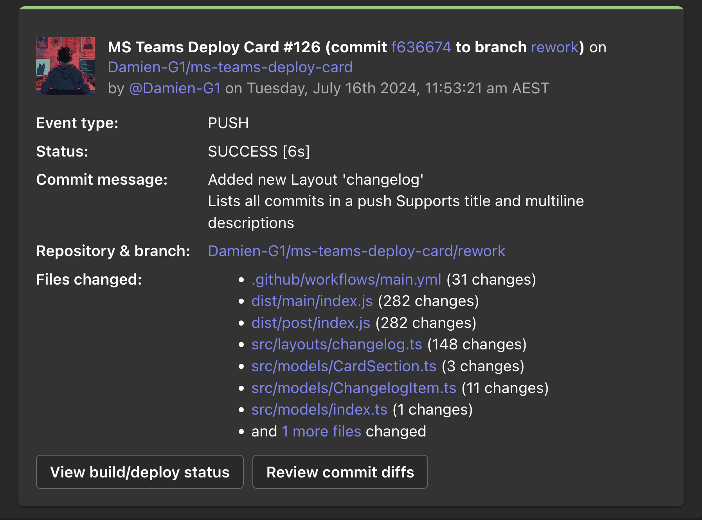

# Microsoft Teams Deploy Card

[](https://github.com/reediculous456/ms-teams-deploy-card/actions/workflows/main.yml)

A comprehensive notification card in Microsoft Teams for your deployments. Forked from [toko-bifrost/ms-teams-deploy-card](https://github.com/toko-bifrost/ms-teams-deploy-card/) due to inactivity.

## Layouts

### Complete



### Cozy


### Compact


## Usage

1. Add `MS_TEAMS_WEBHOOK_URI` on your repository's configs on Settings > Secrets. It is the [webhook URI](https://docs.microsoft.com/en-us/microsoftteams/platform/webhooks-and-connectors/how-to/add-incoming-webhook) of the dedicated Microsoft Teams channel for notification.

2. Add a new `step` on your workflow code below `actions/checkout@v3`:

```yaml
name: MS Teams Deploy Card

on: [push]

jobs:
  build:
    runs-on: ubuntu-latest

    steps:
      - uses: actions/checkout@v2
      # this is the new step
      - uses: reediculous456/ms-teams-deploy-card@v1 #  or "./" if in a local set-up
        if: always()
        with:
          github-token: ${{ github.token }}
          webhook-uri: ${{ secrets.MS_TEAMS_WEBHOOK_URI }}
```

## Configurations

### Main Configurations

| Name                | Required | Default    | Description                                                                                                                                                                                                                                                                |
| ------------------- | -------- | ---------- | -------------------------------------------------------------------------------------------------------------------------------------------------------------------------------------------------------------------------------------------------------------------------- |
| `github-token`      | `true`   | None       | This can be set to the following:<br/>- `${{ github.token }}`<br/>- `${{ secrets.GITHUB_TOKEN }}`<br/>- `${{ secrets.CUSTOM_TOKEN }}`                                                                                                                                      |
| `webhook-uri`       | `true`   | None       | The value of `MS_TEAMS_WEBHOOK_URI`                                                                                                                                                                                                                                        |
| `card-layout-start` | `false`  | `complete` | Card layout on **_start_** (i.e. `complete`, `cozy`, `compact`)                                                                                                                                                                                                            |
| `card-layout-exit`  | `false`  | `compact`  | Card layout on **_exit_** (i.e. `complete`, `cozy`, `compact`)                                                                                                                                                                                                             |
| `show-on-start`     | `false`  | `true`     | Show an MS Teams card upon **_starting_** this Github Actions job                                                                                                                                                                                                          |
| `show-on-exit`      | `false`  | `true`     | Show an MS Teams card upon **_exiting_** this Github Actions job, regardless if it's a successful or a failed exit                                                                                                                                                         |
| `show-on-failure`   | `false`  | `false`    | Show an MS Teams card upon **_exiting_** this Github Actions job and status is `FAILURE`; **This will override any boolean value of `show-on-exit`**, e.g. with `show-on-exit=false` and `show-on-failure=true`, the notification card will still proceed upon job failure |

### Cozy and Complete Layout-specific Configurations

| Name                       | Required | Default                      | Description                                                                                                             |
| -------------------------- | -------- | ---------------------------- | ----------------------------------------------------------------------------------------------------------------------- |
| `environment`              | `false`  | None                         | Name of the environment, e.g. `development`, `production` (won't be included in the card if none)                       |
| `timezone`                 | `false`  | `"UTC"`                      | A [valid database timezone name](https://en.wikipedia.org/wiki/List_of_tz_database_time_zones), e.g. `Australia/Sydney` |
| `enable-view-status-action`       | `false`  | `true`                       | Enable an action to view the deployment status                                                                          |
| `enable-review-diffs-action`      | `false`  | `true`                       | Enable an action to review commit diffs                                                                                 |
| `view-status-action-text`  | `false`  | `"View build/deploy status"` | Customize action text in viewing the deployment status                                                                  |
| `review-diffs-action-text` | `false`  | `"Review commit diffs"`      | Customize action text in reviewing commit diffs                                                                         |
| `custom-actions`           | `false`  | `null`                       | Add more actions; must be a YAML-parseable multiline string with `text` and `url` pairs                                 |
| `ignore-cancel` | `false` | `false` | Don't show an MS Teams card upon **_exiting_** this Github Actions job and status is `CANCELLED`. |

### Complete Layout-specific Configurations

| Name               | Required | Default | Description                                                                                                                                         |
| ------------------ | -------- | ------- | --------------------------------------------------------------------------------------------------------------------------------------------------- |
| `custom-facts`     | `false`  | `null`  | YAML-parseable multiline string defining a list of objects with `name` and `value` to display alongside existing facts. Only for `complete` layout. |
| `include-files`    | `false`  | `true`  | Include the list of files when `layout` is set to `complete`                                                                                        |
| `allowed-file-len` | `false`  | `7`     | Allowed number of changed files to display, when `include-files` is set to `true`                                                                   |

## Local Set-up

1. Clone this repository.
2. Install JS dependencies via `npm install`.
3. Before pushing you changes, execute `npm run build` to create a build on `dist`.
4. Do not remove the `dist` repository. Ever.
5. Check the Actions tab for the errors if there are any.

## Known Issues

- Avoid naming your secrets with the prefix `GITHUB_` as secrets are being used as environment variables, and they are reserved for Github Actions' use only. Better stick with `CI_GITHUB_TOKEN`.

- As this is still in development, always use the working latest version from the `Releases`, as they have more bug fixes and added features.

- If you are going to set `custom-facts` (only for `complete` layout) and `custom-actions` (on both `cozy` and `complete` layout), look out for the pipe symbol (`|`). Github Actions only accept `string`, `number`, and `boolean` as parameters on job steps. To bypass this restriction and to instill YAML list formatting, we have to set it with a YAML-parseable multiline string containing a YAML list of objects with `name` and `value` on `custom-facts`, and `text` and `url` (i.e. must be a valid URI format) on `custom-actions`. If there is an error in YAML parsing, no custom facts/actions will be appended.

```yaml
- uses: reediculous456/ms-teams-deploy-card@v1
  with:
    github-token: ${{ github.token }}
    webhook-uri: ${{ secrets.MS_TEAMS_WEBHOOK_URI }}
    custom-facts: |
      - name: Custom Fact Name 1
        value: Custom Fact Value 1
      - name: Pull Request
        value: "http://example.com/${{ github.run_id }}"
    custom-actions: |
      - text: View PR
        url: "http://valid.uri.com"
      - text: View CI
        url: "http://example.com/${{ github.run_id }}"
```

- Always set this job with `if: always()` when there are steps between `actions/checkout@v2` and this job.

- Status `IN_PROGRESS` upon job completion means you have set the `jobs.<job_id>.name`. It is encouraged to exclude setting the `jobs.<job_id>.name`. It is because `GITHUB_JOB` is set with `jobs.<job_id>`, and the Github API gives off the value of `jobs.<job_id>.name`, if set. Thus, there is no way to match the current job with the ones in the Github API upon post-job conclusion.

- As much as possible, always set this Github action right after `actions/checkout@v2` and before any job steps. The following diagram shows when this job if going to trigger if done the right way.

```
  job
    |-- actions/checkout@v2
      |-- ms-teams-deploy-card (fires notification of job initiation, if allowed)
        |-- step 1
        |...more steps
        |-- step N
      |-- post ms-teams-deploy-card
          * checks the conclusion based on the previous completed steps
          * fires notification if allowed in the settings
    |-- post actions/checkout@v2
```
